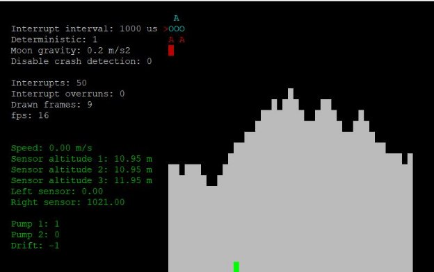

**RTOS 2021-22Q2**

1.- Introduction

In this course, we will define *system* as a compound of software and hardware elements that model the reality. To keep things simple, the only elements that will be considered are *sensors* and *actuators*. Those elements allow to receive information about the system and, based on decisions taken from that information, make the system react properly.

Figure 1 depicts a typical schematic of a real time system in which a set of sensors are connected to one or several process units. Those process units gather the measurements of the sensors and execute the control logic. This control logic, finally, and if needed, sends orders to the actuators.

**Figure 1.-** Schematic view of a real time system.

Next sections describe those elements as well as how to interact with them in the simulator.

2.- Sensors

Sensors are components used to gather information from the system. For example, a thermometer in a car engine will be one sensor. Since sensors in real world may come from different vendors, their access would differ from one sensor to another. This makes sensors present a set of characteristics that must be had into account when accessing these elements. Based on this, sensors are classified depending on the behavior, access and the format of data value.

2.1.- Classification of sensors based on behavior

Depending on the availability of the data the behavior of a sensor can change. There are two possible implementations of sensors:

- Active: an active sensor provides the data automatically every period. So, for reading the sensor, polling must be used.
- Passive: sensor does not provide automatically the data but, first, must be asked to gather that data. Accessing a passive sensor without asking beforehand, could deadlock the system. A request is as simple as sending 1 (one) byte to the sensor (see Section 2.3).

2.2.- Classification of sensors based on the format of their data value

Sensors could provide data in different formats. In this case, we will only consider two of them:

- Integer: the data is a 32 bits 2-complement value (the equivalent to *int* C scalar type)
- Float: the data is a 32 bits IEEE floating point value (the equivalent to *float* C scalar type)

2.3.- Classification of sensors based on how to access the data

The operating system emulated in the system provides a Linux-like way to access devices. This means that every sensor can be accessed using the file system. Based on this, sensors can be accessed using:

- Sockets: in this case, a port number is provided to connect to the software that manages the sensor. So, a TCP connection is required to access the data of that sensor (either an active sensor or passive sensor)
- Named pipes: sensors can be represented also with named pipes. In this case, there are two named pipes per sensor, one for reading (with the suffix *\_read*) and the other for writing (with the suffix *\_write*) requests in case a passive sensor wants to be accessed.

3.- Actuators

Actuators model hardware mechanisms in the system that do something. For example, an actuator can be the steering wheel of a car. As sensors, actuators may come from different vendors, presenting different characteristics, like access, but also present particular characteristics like, for example, notifications. The main difference is that actuators execute *actions*.

3.1. Classification of actuators based on access

As sensors, actuators are represented as devices in the file system (see Section 2.3). For this reason, actuators must be accessed using either sockets or named pipes in the same way sensors are accessed.

3.2.- Classification of actuators based on notifications

Since actuators execute actions that modify the state of the system. These actions are defined on a per-actuator basis (see Section 3.3). Depending on the actuator behavior, a notification of action finished may be received. So, actuators can:

- Notify on finish: whenever the action is completed, the actuator sends a notification to make the system be aware of this fact. This notification consists of a single byte without any special meaning.
- Don’t notify on finish: the actuator does not notify when the action is completed. So, it is not possible to know when the action has actually finished.

3.3.- Actions

Since actuators can modify the state of the system in different ways. These are called *actions*. Actions are defined per actuator which means that an actuator can only execute a reduced set of actions. For example, the brake of a car can be either pushed or released. So, in this case, this actuator will present only 2 actions: “push” and “release”.

To make an actuator execute an action, a message with the name of the action must be send to the actuator. In case the actuator is “don’t notify on finish”, nothing else must be done. If the actuator is “notify on finish”, an extra step must be performed that consists on stalling until the notification of “action is completed” is received.

4.- Control

The control component of the system is the one that reads the information from sensors and, based on decisions taken from those values, makes the actuators execute actions. It is the “brain” of the system.

This control is a piece of software that is executed in a realtime Linux-like operating system that boots on an interrupt-driven hardware with one or more processors and with shared memory banks. The operating system executes tasks that are scheduled by a fixed priority scheduler. There are as many schedulers as processors in the underlying hardware.

The control has two steps. The first step, the boot process, initializes all the connections of sensors and actuators available in the system. Remember that those sensors and actuators are offered as files in the file system. So, basically, during the boot process, the control connects, using either pipes or sockets, to those sensors and actuators.

The second step of the control component effectively executes the software tasks. In every hardware interrupt (there is 1 every millisecond) or whenever a task finishes, the scheduler selects the next task to execute based on a non-preemptive fixed-priority scheduling algorithm that can be either shortest job first or earliest deadline first. Tasks can be periodic or aperiodic and can be created dynamically. And, whenever they are created, it must be enqueued in a task queue (ready queue) where it will wait until it is selected by a scheduler. Once finished, periodic tasks will be automatically enqueued again.

Since the scheduler is executed on an interrupt basis, whenever this logic is being executed, no other interrupt will arrive. This means that overruns are possible in case the execution time of the control logic is longer than the interval between two consecutive interruptions. This may not be necessarily bad.

5.- Structure of the simulator

The code of the simulator is written in C ANSI. It is composed of a Makefile and several files that implement the parts of the system. The description follows.

1. Makefile

The Makefile is the file used to compile and link all the simulator. It compiles every source code file and links all together to create the executable that contains the simulator. To invoke the Makefile is as simple as execute in the main directory of the simulator the command:

\> make

This command will do all the job. We recommend reading carefully the output of this command to detect and solve possible errors.

2. Booting process

During the boot of the simulator, several functions to create and initialize part of the control logic are executed by the operating system. Figure 2 shows the order in which these initialization functions are executed.

**Figure 2.-** Boot process

Whenever the simulator is launched, it first initializes the kernel of the operating system. This kernel prepares the user interface of the system and calls *init\_architecture* to start the schedulers and the task queues. After that, it calls *init\_sensors* and *init\_actuators* to establish the connections with those actors to read data or to write actions. Finally, the kernel executes the *init\_tasks* functions in which all the tasks that will be executed of the control logic are created and enqueued.

3. Simulation parameters

The file *simulation\_parameters.c* holds the configurable parameters of the simulators. Those parameters are:

- Interval: period of time between two consecutive interruptions in microseconds.
- Deterministic: simulator utilizes the same random seeds in all simulations if set to 1 or 0 to create new seeds between simulations.
- Disable\_crash\_detection: disables/enables the crash detection mechanism. Possible values: 0 enables crash detection and 1 disables crash detection.

More parameters of the system can also be found in *simulation\_parameters.c*.

4. Architecture

The underlying architecture can be defined in the file *architecture.c*. This definition includes the number of processors present in the hardware, represented by a scheduler, and ready queues in which tasks are enqueued. Also, how ready queues are shared or not among schedulers can be defined. One ready queue can be shared among schedulers, but a scheduler can access just one ready queue.

The definition of the architecture must be implemented in the function:

int init\_architecture();

in the file *architecture.c*.

1. Ready queue

The ready queue stores all tasks that are ready to be executed. During the boot process of the system, at least one ready queue must be created. To create a ready queue, a variable of type PREADYQUEUE must be declared and initialized with the function:

int Readyqueue\_create(PREADYQUEUE \*queue);

The following code creates and initializes a queue:

PREADYQUEUE task\_queue=NULL;

int init\_architecture()

{

Readyqueue\_create(&task\_queue);

}

From that point onwards, the variable task\_queue can be used by one or more schedulers to select tasks to execute.

2. Schedulers

Processors are represented, from the point of view of the operating system, by schedulers. One scheduler represents a processor that can execute tasks. For that, the scheduler accesses a ready queue to select, based on its scheduling algorithm, the next task, if any, that must be executed. After the task is executed, if it is a periodic task, the scheduler will automatically enqueue this task in the same ready queue.

To create a scheduler, a variable of type PSCHEDULER must be declared and initialized with the function:

int Scheduler\_create(PSCHEDULER \*scheduler, int policy, PREADYQUEUE ready\_queue,

unsigned long long interval);

The parameters of this function are:

-PSCHEDULER \*scheduler: scheduler that will be created

-int policy: scheduling policy of the scheduler. Currently, the scheduler follows a non-preemptive fixed priority scheduling algorithm. The highest priority task is selected depending on the value of this parameter and it can be: SCHEDULING\_SHORTEST\_JOB\_FIRST or SCHEDULING\_EARLIEST\_DEADLINE\_FIRST.

-PREADYQUEUE ready\_queue: ready queue from which the scheduler will select tasks.

-unsigned long long interval: interval of activation of the scheduler in milliseconds. During that activation, the scheduler selects a pending task to execute next. If no pending task is available, the scheduler will stall until the next interval. Since the scheduler is not preemptive, if the current task has not finished execution, the scheduler will not be activated, producing interrupt overruns. An interrupt overrun may not be necessarily bad.

The following code shows how to initialize a scheduler and the associated ready queue:

PREADYQUEUE tasks\_queue=NULL;

PSCHEDULER sensors\_scheduler=NULL;

int init\_architecture()

{

Readyqueue\_create(&tasks\_queue);

Scheduler\_create(&sensors\_scheduler, SCHEDULING\_SHORTEST\_JOB\_FIRST, tasks\_queue, 1);

}

In this case, the scheduler uses the shortest job first priority algorithm in intervals of 1 millisecond.

It is also possible that more than one scheduler shares the same ready queue even if they do not apply the same scheduling algorithm:

PREADYQUEUE tasks\_queue=NULL; PSCHEDULER sensors\_scheduler=NULL; PSCHEDULER actuators\_scheduler=NULL;

int init\_architecture()

{

Readyqueue\_create(&tasks\_queue);

Scheduler\_create(&sensors\_scheduler, SCHEDULING\_SHORTEST\_JOB\_FIRST, tasks\_queue, 1);

Scheduler\_create(&actuators\_scheduler, SCHEDULING\_EARLIEST\_DEADLINE\_FIRST, tasks\_queue, 1);

}

5. Sensors and actuators

The control logic, in the functions init\_sensors and init\_actuators, must establish the connections needed to read values from the sensors and send actions to the actuators. Those connections can be done using either sockets or pipes, depending on the characteristics of those components.

To connect to a sensor or actuator using a socket, a code like the one that follows should be used:

static int connect\_socket(int port, int \*fd)

{

struct sockaddr\_in serv\_addr;

int try;

if ((\*fd = socket(AF\_INET, SOCK\_STREAM, 0)) < 0) {

printf("\n Socket creation error \n"); return -1;

}

serv\_addr.sin\_family = AF\_INET; serv\_addr.sin\_port = htons(port);

// Convert IPv4 and IPv6 addresses from text to binary form if(inet\_pton(AF\_INET, "127.0.0.1", &serv\_addr.sin\_addr)<=0) {

printf("\nInvalid address/ Address not supported \n"); return -1;

}

try=0;

while ((connect(\*fd, (struct sockaddr \*)&serv\_addr, sizeof(serv\_addr)) < 0)&&(try<5))

{

try++;

usleep(500000);

}

if (try==5) return -1;

return 0;

}

From now on, the sensor or actuator can be accessed using the fd integer returned by this function.

In this code, the parameter port is the port number from which the sensor or actuator can be accessed. Notice that since it cannot be ensured that the sensor or actuator is online when the system boots, a protocol of reconnections should be implemented.

In the case of a sensor or actuator available through a named pipe, the code is quite similar:

static int connect\_pipe(char \*pipe\_name, int \*fd\_read, int \*fd\_write) {

char channel\_read[256];

char channel\_write[256];

int try;

sprintf(channel\_read, "%s\_read", pipe\_name); sprintf(channel\_write, "%s\_write", pipe\_name);

try=0;

while (((\*fd\_read = open(channel\_read, O\_RDONLY))<0)&&(try<5)) {

usleep(500000);

try++;

}

if (\*fd\_read<0)

return -1;

try=0;

while (((\*fd\_write = open(channel\_write, O\_RDWR|O\_NONBLOCK))<0)&&(try<5)) {

usleep(500000);

try++;

}

if (\*fd\_write<0)

return -1;

return 0;

}

Since named pipes are not bidirectional, two named pipes must be created: one for reading and the other for writing. In this case, the name used for the named pipes is passed as the first parameter of the function. On return, fd\_read and fd\_write can be used to access the sensor or actuator.

1. Sensors

Sensors have two extra characteristics: behavior and value data type. Behavior defines how the data from the sensor must be retrieved. In this case, a sensor can either be active or passive. An active sensor has the data always available and, thus, can always be read using a code similar to this:

int read\_pipe\_active\_float(int fd, float \*value) {

read(fd, value, sizeof(float));

return 0;

}

Notice that this code is used in case the sensor is active and it must be accessed using a pipe. Also, the data type of the sensor value is from type float and that is why, a float parameter is used to return that data.

The data of passive sensors is not always available. For that reason, first, the sensor must be accessed by sending a byte (which value is meaningless). After that, the data of the sensor will become available:

int read\_socket\_passive\_float(int fd, float \*value) {

char c=0;

send(fd, (char\*)&c, sizeof(char),0);

recv(fd, value, sizeof(float),0);

return 0;

}

In this case, a socket has been used to connect to that sensor.

2. Actuators

The interaction with actuators is message based. Whenever the control logic needs an actuator to perform a particular action, it has to send a message with the name of the action to execute. This procedure involves sending a string to the actuator. For that, first, an integer with the length of the message must be sent, followed by the message itself. The code to do this follows:

char c=0;

int length = strlen(message)+1;

send(fd, (char\*)&length, sizeof(int), 0); send(fd, message, length, 0);

Notice that the length of the message does not include the final ‘\0’ of the string.

Message to actuators are case sensitive. Please check the proposal documentation to ensure that the name of action is correctly sent.

Warning: the code above does not send atomically the message length and the message. This could lead to race condition problems in case several tasks send messages to the same actuator at the same time.

Finally, some actuators send a notification when the action has been completed. In that case, the above code should be:

char c=0;

int length = strlen(message)+1;

send(fd, (char\*)&length, sizeof(int), 0); send(fd, message, length, 0);

recv(fd, (char\*)&c, sizeof(char), 0);

6. Tasks

The set of tasks implement the control logic. They are selected by a scheduler to execute short pieces of code. Ideally, the execution time of a task should fit in the interrupt interval of a scheduler to prevent interruption overruns.

A task is implemented inside a function which header must follow the following pattern:

void task\_function(void \*param);

A task is represented by a variable of type PTASK that must be declared and initialized with the following function:

int Task\_create(PTASK \*new\_task, char \*name, void (\*func)(void \*param), void \*param, unsigned long long period, unsigned long long estimated\_duration);

The parameters are:

-PTASK \*new\_task: new task created

-char \*name: name of the task

-void (\*func)(void \*param): name of the function that holds the code of the task -void \*param: parameter to pass to the task when it is executed

-unsigned long long period: if the task is periodic, this parameter sets the interval time, in milliseconds between two consecutive executions of the task. If the task is aperiodic, this parameter must be 0. In the earliest deadline first scheduling algorithm, the value of this parameters is used to select the next task to execute since it is supposed that the deadline for this task is equivalent to the starting time.

-unsigned long long estimated\_duration: estimated execution time, in milliseconds, of the task. This parameter is used by the shortest job first scheduling algorithm to select the next task to execute.

Once a task is created, it must be enqueued in a ready queue to become selectable for execution. The function to do this is:

int Readyqueue\_enqueue(PREADYQUEUE queue, PTASK task);

in which *queue* is the ready queue to enqueue the task *task*. If the task is periodic, once finished its execution, the scheduler will enqueue the task in the same queue.

Notice that, at least, one task must be created. For that, during the boot process the function init\_tasks is called. This function must have the necessary code to create, at least, one task.

There is no limitation of task creation since they can be created dynamically during the execution of the system.

An example of creating and enqueueing a task that reads a sensor follows:

static float speed=0.0;

void task\_read\_speed(void \*param) {

read\_pipe\_active\_float(speed\_fd\_read, &speed);

}

int init\_tasks() {

PTASK task=NULL;

Task\_create(&task, "Update speed", task\_read\_speed, NULL, 3, 3); Readyqueue\_enqueue(tasks\_queue, task);

}

11
**Lunar landing project RTS2021-22Q2** 

1.- Mission 

The Corporation of Research in AeroSpatial Humanity (C.R.A.S.H.) wants to be the first private corporation in landing an autonomous vehicle on the Moon’s surface. You have been designated to design and implement the Search and Target a Uniform Platform for Initial Docking (S.T.U.P.I.D.) module that will guide the Partially Obsolete Device (P.O.D.) vehicle in its final approach to the Moon’s surface. 

Your mission:  build the S.T.U.P.I.D. module and land the P.O.D. in the moon’s surface.  

2.- The P.O.D. 

The P.O.D. is the new generation of the N-1313 autonomous landing vehicles of the C.R.A.S.H. company. This vehicle has been built to survive the extreme Moon conditions. It incorporates 2 pump engines to control the vertical speed of the P.O.D. and two lateral siphons to change the drift. In addition, there are a series of sensors for altitude calculation and obstacle detection. 

2.1.- Sensors 

The following table summarizes all the information of the available sensors: 

|name |format |Active/passive |Socket/pipe |Port/pipe name |Delay(ms) |
| - | - | - | - | :-: | - |
|Speed |Float |Active |Pipe |Speedpipe |3 |
|Altitude 1 |Float |Passive |socket |20010 |100 |
|Altitude 2 |Float |Passive |Socket |20011 |100 |
|Altitude 3 |Float |Passive |Socket |20012 |100 |
|Left sensor |Integer |Passive |Socket |20015 |300 |
|Right sensor |Integer |Passive |Socket |20016 |300 |
2.2.- Engines 

The following table summarizes all the information related to the available engine: 

|Name |Notify/Dont |Socket/pipe |Port/name |Delay(ms) |Actions |
| - | - | - | - | - | - |
|Pump1 |Don’t notify |socket |20000 |50 |start turnoff |
|Pump2 |Don’t Notify |socket |20001 |50 |start turnoff |
|Drift |Don’t Notify |socket |20002 |500 |left release right |
When a pump is ignited, it generates a vertical acceleration of -0.4m/s^2 (negative means up).  

The drift engine generates a horizontal acceleration of 0.1m/s^2 (positive means right) and works like a steering wheel. The “release” action automatically stops the left and right siphons. 

3.- The Hud 

The Pasadena’s Mission Control Center follows the advances of the P.O.D. in its final approach to the Moon. For that, they monitor in real time the position of the P.O.D. and the current state of the engines and sensors with a screen like the following one: 

Figure 1: HUD 

The screen has two differentiated parts. The left part shows the telemetry of the system (parameters, statistics and sensors and engine states). The right part shows the Moon’s surface and the P.O.D. 

The parameters are: 

- Interrupt interval: period of time between two consecutive clock interrupts, in microseconds 
- Deterministic: the surface is the same between executions 
- Moon gravity: the gravity of the Moon. 
- Interrupts: number of times the scheduler (in the clock interrupt) has been executed 

These parameters, and more, can be changed in the file *system\_parameters.c*. The control statistics are: 

- Interrupt overruns: number of times a clock interruption has been dismissed because the previous interrupt was not completed 
- Drawn frames: number of frames of the interface drawn. 
- FPS: frames per second of the simulator. 

The sensors are: 

- Speed: current vertical speed of the P.O.D. in meters/second (positive means falling) 
- Altitude 1: altitude of the left part of the P.O.D. In meters. 
- Altitude 2: altitude of the center part of the P.O.D. In meters. 
- Altitude 3: altitude of the right part of the P.O.D. In meters. 
- Left sensor: sensor to know how far an obstacle in from the left side of the P.O.D.  
- Right sensor: sensor to know how far an obstacle in from the right side of the P.O.D. 

The engines are: 

- Pump 1: Pump engine 1 (left) state. 0 means turned off. 
- Pump 2: Pump engine 1 (right) state. 0 means turned off. 
- Drift: position of the drift. 0: centered, -1: left siphon on, +1: right siphon on. 

The color of sensors and engines shows if they are connected to the control mechanism. The green color means they are correctly connected. The red color means they are not connected. 

4.- Landing the P.O.D. 

A successful landing of the P.O.D. in the Moon’s surface has the following constraints: 

1.- The altitude must be 0. 

2.- The vertical speed must be under 0.5m/s. 

3.- The landing zone must be flat. This means that the three altitude sensors must have the same value. 

5.- Failing the mission 

A mission will fail if: 

1.- The altitude of the P.O.D. makes it go out from the upper part of the HUD. 

2.- The P.O.D. goes beyond the designated landing area. The P.O.D. starts at the initial location of the landing area. The landing area spreads for 1 Km. 

3.- The landing area is not flat. Ensure that the value of the altitude sensors is the same when landing. 4.- The P.O.D. crashes with an obstacle at left or right. 

In any of these situations the mission will be considered as failed. In that case, please don’t contact with C.R.A.S.H. if possible. We do not want to know anything from you anymore since you have been automatically fired! 

6.- Project milestones 

Milestone 1 (1 point): Disable the crash detection mechanism. 

Milestone 2 (1 point): Define a first version of the S.T.U.P.I.D. module with a single processor (scheduler) and one ready queue. 

Milestone 3 (1 point): Connect all the sensor to the control unit. Milestone 4 (1 point): Connect all the engines to the control unit. 

Milestone 5 (1 point): Create the software logic to control the vertical position of the P.O.D. to prevent crashed. 

Milestone 6 (1 point): Create the software logic to drift left and right the P.O.D. over the landing area without crashing. 

Milestone 7 (1 point): Create the software logic to detect an appropriate landing zone. 

Milestone 8 (1 point): Create the software logic to land the P.O.D. once a landing zone has been detected. 

Milestone 9 (1 point): Redefine the architecture to have three schedulers with one ready queue each. One scheduler will be for accessing sensors, another for engines and the last one for the control logic. Improve the control logic of previous milestones since the system now has more computation power and can execute tasks concurrently. 

Milestone 10 (1 point): Test S.T.U.P.I.D. with a moon gravity acceleration greater than 1 m/s^2 and pump engine acceleration of 1.5 m/s^2. 
4 
